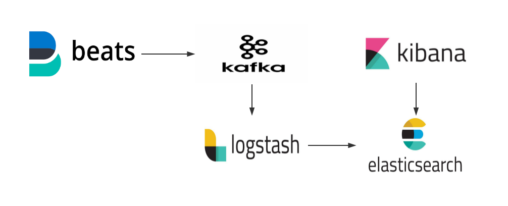

# ELK Cluster

##一、简介

### 1.1、应用场景

​	ELK实际上是三个工具的集合，ElasticSearch + Logstash + Kibana，这三个工具组合形成了一套实用、易用的监控架构，很多公司利用它来搭建可视化的海量日志分析平台。**官网下载地址**：<https://www.elastic.co/downloads>

### 1.2、组件

**Elasticsearch**:

​	Elasticsearch是用Java开发的，是一个基于Lucene的搜索服务器，并作为Apache许可条款下的开放源码发布，是当前流行的企业级搜索引擎。它提供了一个分布式多用户能力的全文搜索引擎，基于RESTful web接口。设计用于云计算中，能够达到实时搜索，稳定，可靠，快速，安装使用方便。

**Logstash**:

​	用于管理日志和事件的工具，你可以用它去收集日志、转换日志、解析日志并将他们作为数据提供给其它模块调用，例如搜索、存储等。

**Kibana**:

​	是一个优秀的前端日志展示框架，它可以非常详细的将日志转化为各种图表，为用户提供强大的数据可视化支持。　　　  

**Filebeat**:

​	类似于 “agent” 装在被监控端上（数据源），用来实时收集日志文件数据。

**Kafka**:

​	接收用户日志的消息队列。

**Zookeeper**:

​	状态管理，监控进程等服务。

### 1.3、ES角色

- Client Node：当master节点和数据节点配置都设置为false的时候，**该节点只能处理路由请求，处理搜索，分发索引操作**等，从本质上来说该客户节点表现为智能负载平衡器。独立的客户端节点在一个比较大的集群中是非常有用的，他协调主节点和数据节点，客户端节点加入集群可以得到集群的状态，根据集群的状态可以直接路由请求。
- Master Node：master节点的主要职责是和集群操作相关的内容，如**创建或删除索引，跟踪哪些节点是群集的一部分，并决定哪些分片分配给相关的节点**。稳定的主节点对集群的健康是非常重要的，默认情况下任何一个集群中的节点都有可能被选为主节点，索引数据和搜索查询等操作会占用大量的cpu，内存，io资源，为了确保一个集群的稳定，分离主节点和数据节点是一个比较好的选择。
- Data Node：数据节点主要是存储索引数据的节点，**主要对文档进行增删改查操作，聚合操作**等。数据节点对cpu，内存，io要求较高， 在优化的时候需要监控数据节点的状态，当资源不够的时候，需要在集群中添加新的节点。
- Ingest Node：Ingest 节点是 Elasticsearch 5.0 新增的节点类型和功能。其开启方式为：node.ingest: true。Ingest 节点的基础原理是：节点接收到数据之后，根据请求参数中指定的管道流 id，找到对应的已注册管道流，对数据进行处理，然后将处理过后的数据，按照 Elasticsearch 标准的 indexing 流程继续运行。


 ## 二、架构

### 2.1、架构图



 

### 2.2、部署环境

<table>
   <tr>
      <td>role</td>
      <td>hostname</td>
      <td>cpu</td>
      <td>mem</td>
      <td>disk1</td>
      <td>disk2</td>
      <td>ip</td>
   </tr>
   <tr>
      <td rowspan="3">master</td>
      <td>es-master-01</td>
      <td>8</td>
      <td>32</td>
      <td>200G</td>
      <td>-</td>
      <td>172.16.9.1</td>
   </tr>
   <tr>
      <td>es-master-02</td>
      <td>8</td>
      <td>32</td>
      <td>200G</td>
      <td>-</td>
      <td>172.16.9.2</td>
   </tr>
   <tr>
      <td>es-master-03</td>
      <td>8</td>
      <td>32</td>
      <td>200G</td>
      <td>-</td>
      <td>172.16.9.3</td>
   </tr>
   <tr>
      <td rowspan="3">client</td>
      <td>es-client-01</td>
      <td>8</td>
      <td>32</td>
      <td>200G</td>
      <td>-</td>
      <td>172.16.9.4</td>
   </tr>
   <tr>
      <td>es-client-02</td>
      <td>8</td>
      <td>32</td>
      <td>200G</td>
      <td>-</td>
      <td>172.16.9.5</td>
   </tr>
   <tr>
      <td>es-client-03</td>
      <td>8</td>
      <td>32</td>
      <td>200G</td>
      <td>-</td>
      <td>172.16.9.6</td>
   </tr>
   <tr>
      <td rowspan="3">data:hot</td>
      <td>es-data-hot-01</td>
      <td>16</td>
      <td>64</td>
      <td>2T</td>
      <td>2T</td>
      <td>172.16.9.7</td>
   </tr>
   <tr>
      <td>es-data-hot-02</td>
      <td>16</td>
      <td>64</td>
      <td>2T</td>
      <td>2T</td>
      <td>172.16.9.8</td>
   </tr>
   <tr>
      <td>es-data-hot-03</td>
      <td>16</td>
      <td>64</td>
      <td>2T</td>
      <td>2T</td>
      <td>172.16.9.9</td>
   </tr>
   <tr>
      <td rowspan="3">data:cold</td>
      <td>es-data-cold-01</td>
      <td>8</td>
      <td>32</td>
      <td>2T</td>
      <td>2T</td>
      <td>172.16.9.10</td>
   </tr>
   <tr>
      <td>es-data-cold-02</td>
      <td>8</td>
      <td>32</td>
      <td>2T</td>
      <td>2T</td>
      <td>172.16.9.11</td>
   </tr>
   <tr>
      <td>es-data-cold-03</td>
      <td>8</td>
      <td>32</td>
      <td>2T</td>
      <td>2T</td>
      <td>172.16.9.12</td>
   </tr>
   <tr>
      <td rowspan="3">logstash</td>
      <td>es-logstash-01</td>
      <td>8</td>
      <td>16</td>
      <td>200G</td>
      <td>-</td>
      <td>172.16.9.13</td>
   </tr>
   <tr>
      <td>es-logstash-02</td>
      <td>8</td>
      <td>16</td>
      <td>200G</td>
      <td>-</td>
      <td>172.16.9.14</td>
   </tr>
   <tr>
      <td>es-logstash-03</td>
      <td>8</td>
      <td>16</td>
      <td>200G</td>
      <td>-</td>
      <td>172.16.9.15</td>
   </tr>
   <tr>
      <td rowspan="3">kafka</td>
      <td>es-kafka-01</td>
      <td>16</td>
      <td>32</td>
      <td>500G</td>
      <td>500G</td>
      <td>172.16.9.16</td>
   </tr>
   <tr>
      <td>es-kafka-02</td>
      <td>16</td>
      <td>32</td>
      <td>500G</td>
      <td>500G</td>
      <td>172.16.9.17</td>
   </tr>
   <tr>
      <td>es-kafka-03</td>
      <td>16</td>
      <td>32</td>
      <td>500G</td>
      <td>500G</td>
      <td>172.16.9.18</td>
   </tr>
   <tr>
      <td rowspan="3">zookeeper</td>
      <td>es-zk-01</td>
      <td>8</td>
      <td>16</td>
      <td>200G</td>
      <td>-</td>
      <td>172.16.9.19</td>
   </tr>
   <tr>
      <td>es-zk-02</td>
      <td>8</td>
      <td>16</td>
      <td>200G</td>
      <td>-</td>
      <td>172.16.9.20</td>
   </tr>
   <tr>
      <td>es-zk-03</td>
      <td>8</td>
      <td>16</td>
      <td>200G</td>
      <td>-</td>
      <td>172.16.9.21</td>
   </tr>
   <tr>
      <td rowspan="2">kibana</td>
      <td>es-kibana-01</td>
      <td>8</td>
      <td>16</td>
      <td>100G</td>
      <td></td>
      <td>172.16.9.22</td>
   </tr>
   <tr>
      <td>es-kibana-02</td>
      <td>8</td>
      <td>16</td>
      <td>100G</td>
      <td></td>
      <td>172.16.9.23</td>
   </tr>
   <tr>
      <td></td>
   </tr>
</table>

⚠️：

```
1、Master 内存不应低于32G，否则可以导致较多 UNASSIGNED Shards 且不能自动或手动分配
2、对于Data节点，CPU推荐与内存至少1:4
3、es节点磁盘建议使用多块裸盘，不建议使用lvm
4、jvm建议配置为内存的一半，并且不超过32G
```


## 三、部署ELK

### 3.1、elasticsearch

#### 3.1.1、安装elasticsearch

由于Elasticsearch7已自带JRE（当系统环境变量 JAVA_HOME为空时），故无需再额外安装JRE。

```
yum -y install https://mirrors.tuna.tsinghua.edu.cn/elasticstack/7.x/yum/7.3.0/elasticsearch-7.3.0-x86_64.rpm
```

#### 3.1.2、创建数据目录

```
mkdir -p /data/data/es && chown -R elasticsearch.elasticsearch  /data/data/es
mkdir -p /data/logs/es && chown -R elasticsearch.elasticsearch  /data/logs/es
```

#### 3.1.3、修改Limits

/etc/security/limits.conf

```
elasticsearch   hard    memlock     unlimited
elasticsearch   soft    memlock     unlimited
```

/usr/lib/systemd/system/elasticsearch.service

```
[Service]
LimitMEMLOCK=infinity
```

#### 3.1.4、配置JVM

/etc/elasticsearch/jvm.options

```
-Xms32g
-Xmx32g
```

```
## GC configuration
#-XX:+UseConcMarkSweepGC
#-XX:CMSInitiatingOccupancyFraction=75
#-XX:+UseCMSInitiatingOccupancyOnly
-XX:+UseG1GC
```

⚠️：注释CMS垃圾回收配置，启用G1

#### 3.1.5、修改主配置文件

/etc/elasticsearch/elasticsearch.yml

**master节点：**

```
cluster.name: es
node.name: es-master-01

node.master: true
node.data: false

node.attr.zone: "shanghai"
node.max_local_storage_nodes: 1

path.data: /data/data/es
path.logs: /data/logs/es

bootstrap.memory_lock: true

http.host: 0.0.0.0
http.port: 9200
http.max_content_length: 100mb
http.max_initial_line_length: 4kb
http.max_header_size: 8kb
http.compression: true

network.host: 0.0.0.0

transport.host: 0.0.0.0
transport.tcp.connect_timeout: 30s
transport.ping_schedule: 5s
transport.tcp.port: 9300
transport.publish_port: 9300
transport.tcp.compress: true

discovery.zen.ping.unicast.hosts: ["172.16.9.4", "172.16.9.5", "172.16.9.6"]
cluster.initial_master_nodes: ["172.16.9.4", "172.16.9.5", "172.16.9.6"]
discovery.zen.join_timeout: 10s
discovery.zen.minimum_master_nodes: 2
discovery.zen.ping_timeout: 100s
discovery.zen.fd.ping_timeout: 100s

gateway.expected_nodes: 2
gateway.recover_after_nodes: 3
gateway.recover_after_time: 10m

action.destructive_requires_name: true

indices.recovery.max_bytes_per_sec: 60mb
indices.fielddata.cache.size: 20%
indices.breaker.fielddata.limit: 60%
indices.breaker.request.limit: 40%
indices.breaker.total.limit: 95%
indices.breaker.total.use_real_memory: true

cluster.routing.allocation.disk.threshold_enabled: true
cluster.routing.allocation.disk.watermark.low: 90%
cluster.routing.allocation.disk.watermark.high: 90%
cluster.routing.allocation.node_concurrent_recoveries: 3
cluster.routing.allocation.node_initial_primaries_recoveries: 10
cluster.routing.allocation.awareness.force.zone.values: ["shanghai"]
cluster.routing.allocation.awareness.attributes: zone
```

**Client节点：**

```
cluster.name: es
node.name: es-client-01

node.master: false
node.data: false

node.attr.zone: "shanghai"
node.max_local_storage_nodes: 1

path.data: /data/data/es
path.logs: /data/logs/es

bootstrap.memory_lock: true

http.host: 0.0.0.0
http.port: 9200
http.max_content_length: 100mb
http.max_initial_line_length: 4kb
http.max_header_size: 8kb
http.compression: true

network.host: 0.0.0.0

transport.host: 0.0.0.0
transport.tcp.connect_timeout: 30s
transport.ping_schedule: 5s
transport.tcp.port: 9300
transport.publish_port: 9300
transport.tcp.compress: true

discovery.zen.ping.unicast.hosts: ["172.16.9.4", "172.16.9.5", "172.16.9.6"]
cluster.initial_master_nodes: ["172.16.9.4", "172.16.9.5", "172.16.9.6"]
discovery.zen.join_timeout: 10s
discovery.zen.minimum_master_nodes: 2
discovery.zen.ping_timeout: 100s
discovery.zen.fd.ping_timeout: 100s

gateway.expected_nodes: 2
gateway.recover_after_nodes: 3
gateway.recover_after_time: 10m

action.destructive_requires_name: true

indices.recovery.max_bytes_per_sec: 60mb
indices.fielddata.cache.size: 20%
indices.breaker.fielddata.limit: 60%
indices.breaker.request.limit: 40%
indices.breaker.total.limit: 95%
indices.breaker.total.use_real_memory: true

cluster.routing.allocation.disk.threshold_enabled: true
cluster.routing.allocation.disk.watermark.low: 90%
cluster.routing.allocation.disk.watermark.high: 90%
cluster.routing.allocation.node_concurrent_recoveries: 3
cluster.routing.allocation.node_initial_primaries_recoveries: 10
cluster.routing.allocation.awareness.force.zone.values: ["shanghai"]
cluster.routing.allocation.awareness.attributes: zone
```

**Data:hot节点：**

```
cluster.name: es
node.name: es-client-01

node.master: false
node.data: true
node.attr.box_type: hot

node.attr.zone: "shanghai"
node.max_local_storage_nodes: 1

path.data: /data/data/es
path.logs: /data/logs/es

bootstrap.memory_lock: true

http.host: 0.0.0.0
http.port: 9200
http.max_content_length: 100mb
http.max_initial_line_length: 4kb
http.max_header_size: 8kb
http.compression: true

network.host: 0.0.0.0

transport.host: 0.0.0.0
transport.tcp.connect_timeout: 30s
transport.ping_schedule: 5s
transport.tcp.port: 9300
transport.publish_port: 9300
transport.tcp.compress: true

discovery.zen.ping.unicast.hosts: ["172.16.9.4", "172.16.9.5", "172.16.9.6"]
cluster.initial_master_nodes: ["172.16.9.4", "172.16.9.5", "172.16.9.6"]
discovery.zen.join_timeout: 10s
discovery.zen.minimum_master_nodes: 2
discovery.zen.ping_timeout: 100s
discovery.zen.fd.ping_timeout: 100s

gateway.expected_nodes: 2
gateway.recover_after_nodes: 3
gateway.recover_after_time: 10m

action.destructive_requires_name: true

indices.recovery.max_bytes_per_sec: 60mb
indices.fielddata.cache.size: 20%
indices.breaker.fielddata.limit: 60%
indices.breaker.request.limit: 40%
indices.breaker.total.limit: 95%
indices.breaker.total.use_real_memory: true

cluster.routing.allocation.disk.threshold_enabled: true
cluster.routing.allocation.disk.watermark.low: 90%
cluster.routing.allocation.disk.watermark.high: 90%
cluster.routing.allocation.node_concurrent_recoveries: 3
cluster.routing.allocation.node_initial_primaries_recoveries: 10
cluster.routing.allocation.awareness.force.zone.values: ["shanghai"]
cluster.routing.allocation.awareness.attributes: zone
```

**Data:cold节点：**

```
cluster.name: es
node.name: es-client-01

node.master: false
node.data: true
node.attr.box_type: cold

node.attr.zone: "shanghai"
node.max_local_storage_nodes: 1

path.data: /data/data/es
path.logs: /data/logs/es

bootstrap.memory_lock: true

http.host: 0.0.0.0
http.port: 9200
http.max_content_length: 100mb
http.max_initial_line_length: 4kb
http.max_header_size: 8kb
http.compression: true

network.host: 0.0.0.0

transport.host: 0.0.0.0
transport.tcp.connect_timeout: 30s
transport.ping_schedule: 5s
transport.tcp.port: 9300
transport.publish_port: 9300
transport.tcp.compress: true

discovery.zen.ping.unicast.hosts: ["172.16.9.4", "172.16.9.5", "172.16.9.6"]
cluster.initial_master_nodes: ["172.16.9.4", "172.16.9.5", "172.16.9.6"]
discovery.zen.join_timeout: 10s
discovery.zen.minimum_master_nodes: 2
discovery.zen.ping_timeout: 100s
discovery.zen.fd.ping_timeout: 100s

gateway.expected_nodes: 2
gateway.recover_after_nodes: 3
gateway.recover_after_time: 10m

action.destructive_requires_name: true

indices.recovery.max_bytes_per_sec: 60mb
indices.fielddata.cache.size: 20%
indices.breaker.fielddata.limit: 60%
indices.breaker.request.limit: 40%
indices.breaker.total.limit: 95%
indices.breaker.total.use_real_memory: true

cluster.routing.allocation.disk.threshold_enabled: true
cluster.routing.allocation.disk.watermark.low: 90%
cluster.routing.allocation.disk.watermark.high: 90%
cluster.routing.allocation.node_concurrent_recoveries: 3
cluster.routing.allocation.node_initial_primaries_recoveries: 10
cluster.routing.allocation.awareness.force.zone.values: ["shanghai"]
cluster.routing.allocation.awareness.attributes: zone
```

#### 3.1.6、启动服务

```
systemctl daemon-reload
systemctl restart elasticsearch
systemctl status elasticsearch
```

#### 3.1.7、查看端口状态

```
ss -tnl 
```

#### 3.1.8、验证集群

```
curl 'http://127.0.0.1:9200/_cluster/health?pretty'
curl 'http://127.0.0.1:9200/_cat/nodes'
```


### 3.2、Logstash

#### 3.2.1、安装logstash

```
yum -y install https://mirrors.tuna.tsinghua.edu.cn/elasticstack/7.x/yum/7.3.0/logstash-7.3.0.rpm
```

#### 3.2.2、修改jvm

/etc/logstash/jvm.options

```
-Xms8g
-Xmx8g
```

```
## GC configuration
#-XX:+UseConcMarkSweepGC
#-XX:CMSInitiatingOccupancyFraction=75
#-XX:+UseCMSInitiatingOccupancyOnly
-XX:+UseG1GC
```

⚠️：注释CMS垃圾回收配置，启用G1

#### 3.2.3、修改主配置文件

/etc/logstash/logstash.yml

```
http.host: "0.0.0.0"
http.port: 9600-9700

path.data: /data/data/logstash

log.level: warn
path.logs: /data/logs/logstash

pipeline.workers: 4
pipeline.batch.size: 125
pipeline.batch.delay: 50
config.reload.automatic: false
queue.max_bytes: 2048mb
queue.checkpoint.acks: 1024
queue.checkpoint.writes: 1024
dead_letter_queue.max_bytes: 1024mb
```

#### 3.2.4、创建消费kafka配置文件

```
input {
  kafka {
    bootstrap_servers => "172.16.9.16:9092,172.16.9.17:9092,172.16.9.18:9092"
    topics => ["k8s-logs"]
    client_id => "k8s-logs"
    group_id => "logstash-01"
    auto_offset_reset => "latest"
    consumer_threads => 3
    decorate_events => true
  }
}

filter {
  json {
    source => "message"
    remove_field => [ "message" ]
  }
}

output {
  elasticsearch {
    hosts => ["172.16.9.4:9200","172.16.9.5:9200","172.16.9.6:9200"]
    index => "%{[@metadata][kafka][topic]}-%{+YYYY.MM.dd}"
    timeout => 300
  }
}
```

#### 3.2.5、启动服务

```
systemctl restart logstash
systemctl enable logstash
```

#### 3.2.6、查看端口状态

```
ss -tnl 　　//存在延迟可能，多等些时间
```


### 3.3、Kibana

#### 3.3.1、安装Kibana

```
yum -y install https://mirrors.tuna.tsinghua.edu.cn/elasticstack/7.x/yum/7.3.0/kibana-7.3.0-x86_64.rpm
```

#### 3.3.2、修改配置文件

/etc/kibana/kibana.yml

```
server.port: 5601
server.host: "0.0.0.0"
elasticsearch.url: "http://172.16.9.5:9200" //接es的地址
```

#### 3.3.3、启动kibana

```
systemctl start kibana
systemctl status kibana
```

#### 3.3.4、查看端口状态

```
ss -tnl
```


### 3.4、Filebeat

在**客户端**上安装并启动**filebeat**

#### 3.4.1、安装filebeat

```
yum -y install https://mirrors.tuna.tsinghua.edu.cn/elasticstack/7.x/yum/7.3.0/filebeat-7.3.0-x86_64.rpm
```

#### 3.4.2、修改配置文件

/etc/filebeat/filebeat.reference.yml

```
close_removed: true
clean_removed: true
```

/etc/filebeat/filebeat.yml

```
filebeat.inputs:
- type: log
  enabled: false
  paths:
    - /var/log/messages
    - /var/log/*.log
- type: container
  paths:
    - /var/lib/docker/containers/*/*.log
  json.keys_under_root: true
  json.add_error_key: true
  json.message_key: log
  fields_under_root: true
  scan_frequency: 5s
  max_bytes: 1048576
  processors:
  - decode_json_fields:
      fields: ["message"]
      target: ""
  processors:
    - add_kubernetes_metadata:
        in_cluster: true
        host: ${NODE_NAME}
        matchers:
        - logs_path:
            logs_path: "/var/lib/docker/containers/"

output.kafka:
  enabled: true
  hosts: ["172.16.9.16:9092", "172.16.9.17:9092", "172.16.9.18:9092"]
  topic: 'k8s-logs'
  partition.round_robin:
    reachable_only: false
  required_acks: 1
  compression: gzip
  max_message_bytes: 1000000
```

#### 3.4.3、启动filebeat服务

```
systemctl restart filebeat
systemctl enable filebeat
```


### 3.5、zookeeper&kafka

参考文档《zookeeper&kafka集群部署》


### 3.6、Elasticsearch安装插件

#### 3.6.1、安装analysis-ik

```
/usr/share/elasticsearch/bin/elasticsearch-plugin install https://github.com/medcl/elasticsearch-analysis-ik/releases/download/v7.3.0/elasticsearch-analysis-ik-7.3.0.zip
```

#### 3.6.2、安装prometheus

```
/usr/share/elasticsearch/bin/elasticsearch-plugin install https://github.com/vvanholl/elasticsearch-prometheus-exporter/releases/download/7.3.0.0/prometheus-exporter-7.3.0.0.zip
```


## 四、名词解释

### 4.1、分片与副本

新建、索引和删除请求都是写(write)操作，它们必须在主分片上成功完成才能复制到相关的复制分片上,下面我们罗列在主分片和复制分片上成功新建、索引或删除一个文档必要的顺序步骤：

1、客户端给Node 1发送新建、索引或删除请求。

2、节点使用文档的_id确定文档属于分片0。它转发请求到Node 3，分片0位于这个节点上。

3、Node 3在主分片上执行请求，如果成功，它转发请求到相应的位于Node 1和Node 2的复制节点上。当所有的复制节点报告成功，Node 3报告成功到请求的节点，请求的节点再报告给客户端。

客户端接收到成功响应的时候，文档的修改已经被应用于主分片和所有的复制分片。你的修改生效了。

> 一个索引要分多少片？什么时候该扩容？
> 取决于硬件和你对响应速度的要求，一般来说一个shard的数据量控制在1、2千万的级别，速度都还好，过亿会比较缓慢。 但是任何事物都有两面，shard划分比较小，必然数量就比较多。 在用户做1、2天数据搜索的时候可能还好，如果搜更长时间的数据，一次搜索需要并行搜索的shard就比较多。如果节点数量有限，就会比较吃力,需要扩充更多的节点


### 4.2、分片算法

shard = hash(routing) % number_of_primary_shards
routing值是一个任意字符串，它默认是_id但也可以自定义，这个routing字符串通过哈希函数生成一个数字，然后除以主切片的数量得到一个余数(remainder)，余数的范围永远是0到number_of_primary_shards - 1，这个数字就是特定文档所在的分片。

这也解释了为什么主切片的数量只能在创建索引时定义且不能修改：如果主切片的数量在未来改变了，所有先前的路由值就失效了，文档也就永远找不到了。

所有的文档API（get、index、delete、bulk、update、mget）都接收一个routing参数，它用来自定义文档到分片的映射。自定义路由值可以确保所有相关文档.比如用户的文章,按照用户账号路由,就可以实现属于同一用户的文档被保存在同一分片上。

2)分片与副本交互：


## 五、常见问题

### 5.1、Unassigned Shards 问题可能的原因？

- INDEX_CREATED:  由于创建索引的API导致未分配。
- CLUSTER_RECOVERED:  由于完全集群恢复导致未分配。
- INDEX_REOPENED:  由于打开open或关闭close一个索引导致未分配。
- DANGLING_INDEX_IMPORTED:  由于导入dangling索引的结果导致未分配。
- NEW_INDEX_RESTORED:  由于恢复到新索引导致未分配。
- EXISTING_INDEX_RESTORED:  由于恢复到已关闭的索引导致未分配。
- REPLICA_ADDED:  由于显式添加副本分片导致未分配。
- ALLOCATION_FAILED:  由于分片分配失败导致未分配。
- NODE_LEFT:  由于承载该分片的节点离开集群导致未分配。
- REINITIALIZED:  由于当分片从开始移动到初始化时导致未分配（例如，使用影子shadow副本分片）。
- REROUTE_CANCELLED:  作为显式取消重新路由命令的结果取消分配。
- REALLOCATED_REPLICA:  确定更好的副本位置被标定使用，导致现有的副本分配被取消，出现未分配。

