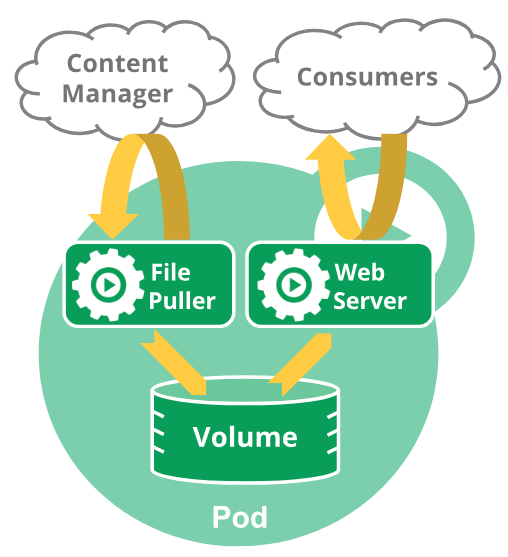

[TOC]

# 一、Pod简介

## 1、什么是Pod 

​		在Kubernetes集群中，Pod是所有业务类型的基础，它是一个或多个容器的组合。这些容器共享存储、网络和命名空间，以及如何运行的规范。在Pod中，所有容器都被统一安排和调度，并运行在共享的上下文中。对于具体应用而言，Pod是它们的逻辑主机，Pod包含业务相关的多个应用容器。Kubernetes不只是支持Docker容器，它也支持其他容器。Pod 的上下文可以理解成多个linux命名空间的联合：

- PID 命名空间（同一个Pod中应用可以看到其它进程）
- 网络 命名空间（同一个Pod的中的应用对相同的IP地址和端口有权限）
- IPC 命名空间（同一个Pod中的应用可以通过VPC或者POSIX进行通信）
- UTS 命名空间（同一个Pod中的应用共享一个主机名称）

​		一个Pod的共享上下文是Linux命名空间、cgroups和其它潜在隔离内容的集合。 在Pod中，容器共享一个IP地址和端口空间，它们可以通过localhost发现彼此。在同一个Pod中的容器，可以使用System V 或POSIX信号进行标准的进程间通信和共享内存。在不同Pod中的容器，拥有不同的IP地址，因此不能够直接在进程间进行通信。容器间通常使用Pod IP地址进行通信。在一个Pod中的应用于口访问共享的存储卷，它被定为为Pod的一部分，可以被挂接至每一个应用文件系统。与独立的应用容器一样，Pod是一个临时的实体，它有着自己的生命周期。在Pod被创建时，会被指派一个唯一的ID，并被调度到Node中，直到Pod被终止或删除。如果Pod所在的Node宕机，给定的Pod（即通过UID定义）不会被重新调度。相反，它将被完全相同的Pod所替代。这所说的具有和Pod相关生命周期的情况，例如存储卷，是说和Pod存在的时间一样长。如果Pod被删除，即使完全相同的副本被创建，则相关存储卷等也会被删除，并会为Pod创建一个新的存储卷等。Pod本身就没有打算作为持久化的实体，在调度失败、Node失败和获取其它退出（缺少资源或者Node在维护）情况下，Pod都会被删除。一般来说，用户不应该直接创建Pod，即是创建单个的Pod也应该通过控制器创建。在集群范围内，控制器为Pod提供自愈能力，以及副本和部署管理。

*一个多容器的**Pod**会包含一个文件拉取器和一个**web**服务器，此**web**服务器使用一个持久化存储卷来在容器中共享存储。*



**网络：**每一个Pod都会被指派一个唯一的Ip地址，在Pod中的每一个容器共享网络命名空间，包括Ip地址和网络端口。在同一个Pod中的容器可以同locahost进行互相通信。当Pod中的容器需要与Pod外的实体进行通信时，则需要通过端口等共享的网络资源。

**存储：**Pod能够被指定共享存储卷的集合，在Pod中所有的容器能够访问共享存储卷，允许这些容器共享数据。存储卷也允许在一个Pod持久化数据，以防止其中的容器需要被重启。


## 2、Pod的工作方式

​		在Kubernetes中一般不会直接创建一个独立的Pod，这是因为Pod是临时存在的一个实体。当直接创建一个独立的Pod时，如果缺少资源或者所被调度到的Node失败，则Pod会直接被删除。这里需要注意的是，重起Pod和重起Pod中的容器不是一个概念，Pod自身不会运行，它只是容器所运行的一个环境。Pod本身没有自愈能力，如果Pod所在的Node失败，或者如果调度操作本身失败，则Pod将会被删除；同样的，如果缺少资源，Pod也会失败。Kubernetes使用高层次的抽象，即控制器来管理临时的Pod。通过控制器能够创建和管理多个Pod，并在集群范围内处理副本、部署和提供自愈能力。例如，如果一个Node失败，控制器可以自动的在另外一个节点上部署一个完全一样的副本。控制器是Pod模板来创建Pod，Pod的控制器包括：

- [Deployment](https://kubernetes.io/docs/concepts/workloads/controllers/deployment/)
- [StatefulSet](https://kubernetes.io/docs/concepts/workloads/controllers/statefulset/)
- [DaemonSet](https://kubernetes.io/docs/concepts/workloads/controllers/daemonset/)

Pod模板是一个被包含在其它对象(例如：Deployment、StatefuleSet、DaemonSet等)中的Pod规格。控制使用Pod模板创建实际的Pod，下面是Deployment模板的一个示例：

```yaml
apiVersion: apps/v1beta2
kind: Deployment
metadata:
  name: nginx
  namespace: default
spec:
  replicas: 1
  revisionHistoryLimit: 10
  selector:
    matchLabels:
      app: nginx
  strategy:
    rollingUpdate:
      maxSurge: 25%
      maxUnavailable: 25%
    type: RollingUpdate
  minReadySeconds: 5
  template:
    metadata:
      labels:
        app: nginx
    spec:
      affinity:
        nodeAffinity:
          requiredDuringSchedulingIgnoredDuringExecution:
            nodeSelectorTerms:
            - matchExpressions:
              - key: app
                operator: In
                values:
                - nginx
      containers:
      - name: nginx
        image: k8sre/nginx:1.16.0
        imagePullPolicy: Always
        ports:
        - containerPort: 80
        env:
        - name: "APP_PORT"
          value: "80"
        - name:  "APP_NAMESPACE"
          valueFrom:
            fieldRef:
              fieldPath: metadata.namespace
        resources:
          limits:
            cpu: 100m
            memory: 512Mi
          requests:
            cpu: 50m
            memory: 256Mi
        livenessProbe:
          httpGet:
            path: /
            port: 80
          initialDelaySeconds: 60
          timeoutSeconds: 5
          periodSeconds: 10
        readinessProbe:
          httpGet:
            path: /
            port: 80
          initialDelaySeconds: 60
          timeoutSeconds: 5
          periodSeconds: 10
      terminationGracePeriodSeconds: 60
      restartPolicy: Always
      imagePullSecrets:
      - name: hubsecret
```


## 3、Pod更新策略

在Pod中有两种更新策略，在配置文件中通过`strategy.type`字段设置镜像的拉取策略：

- Recreate：重建更新，就是删除一个Pod，再重建一个Pod。
- RollingUpdate：滚动更新，一次只更新一部分，成功后，再逐步更新更多的副本，最终完成所有副本的更新。滚动更新最大的好处是零停机，整个更新过程始终有副本在运行，从而保证了业务的连续性。

注意：当`type`为`Recreate`时，与`type`同级的`rollingUpdate`字段就失效了。当`type`为`RollingUpdate`时，与`type`同级的`rollingUpdate`字段定义滚动更新的策略。

```
  revisionHistoryLimit: 10
  strategy:
    rollingUpdate:
      maxSurge: 25%
      maxUnavailable: 25%
    type: RollingUpdate
  minReadySeconds: 5
```

- minReadySeconds：
  - kubernetes在等待设置的时间后才进行升级
  - 如果没有设置该值，kubernetes会假设该容器启动起来后就提供服务了
  - 如果没有设置该值，在某些极端情况下，可能会造成服务无法正常运行（新建Pod未进入可提供服务阶段）

- maxSurge：
  - 升级过程中，最多可以超出replicas定义的Pod副本数的个数。
  - 若replicas设置为2，maxSurge设置为1，则整个升级过程中，最多允许2+1个pod
  - 有两种取值方式：1.指定一个数字（5）；2.指定一个百分比（25%）
- maxUnavailable：
  - 升级过程中，最多可以有几个不可用
  - 若replicas设置为5，maxUnavailable设置为1，那么可用的Pod数为5-1个
  - 当maxSurge不为0时，maxUnavailable也不能为0
  - 有两种取值方式：1.指定一个数字（5）；2.指定一个百分比（25%）

- revisionHistoryLimit: 
  - 要保留以允许回滚的旧的replicas的数量。默认是10个。如果为0，表示不保存旧版本。


## 4、Pod重启策略

​		在Pod中的容器可能会由于异常等原因导致其终止退出，Kubernetes提供了重启策略以重启容器。重启策略对同一个Pod的所有容器起作用，容器的重启由Node上的kubelet执行。Pod支持三种重启策略，在配置文件中通过`restartPolicy`字段设置重启策略：

- Always：只要退出就会重启。这个是默认值。
- OnFailure：只有在失败退出（exit code不等于0）时，才会重启。
- Never：只要退出，就不再重启

注意，这里的重启是指在Pod的宿主Node上进行本地重启，而不是调度到其它Node上。


## 5、镜像拉取策略

​		在Kubernetes中，容器的运行是基于容器镜像的。Pod支持三种镜像拉取策略，在配置文件中通过`imagePullPolicy`字段设置镜像的拉取策略：

- Always：不管本地是否存在镜像都会进行一次拉取。
- Never：不管本地是否存在镜像都不会进行拉取。
- IfNotPresent：仅在本地镜像不存在时，才会进行镜像拉取。

注意：

- 镜像拉取策略的默认值为IfNotPresent，但:latest标签的镜像默认为Always。
- 拉取镜像时docker会进行校验，如果镜像中的MD5码没有变，则不会拉取镜像数据。
- 生产环境中应该尽量避免使用:latest标签，而开发环境中可以借助:latest标签自动拉取最新的镜像。


## 6、使用私钥镜像仓库

​		在Kubernetes中运行容器时，需要为容器获取镜像。Pod中容器的镜像有三个来源，即Docker公共镜像仓库、私有镜像仓库和本地镜像。当在内网使用的Kubernetes场景下，就需要搭建和使用私有镜像仓库。在使用私有镜像拉取镜像时，需要为私有镜像仓库创建一个docker registry secret，并在创建容器中进行引用。

通过kubectl create secret docker-registry命令创建docker registry secret：

```
kubectl create secret docker-registry <NAME> --docker-server=<your-registry-server> \
--docker-username=<your-name> --docker-password=<your-pword> --docker-email=<your-email>
```

在Pod中通过`imagePullSecrets`字段指定该secret：

```
      imagePullSecrets:
      - name: hubsecret
```


## 7、资源限制

​		Kubernetes通过cgroups来限制容器的CPU和内存等计算资源，在创建Pod时，可以为Pod中的每个容器设置资源请求(request)和资源限制(limit)，资源请求是容器需要的最小资源要求，资源限制为容器所能使用的资源上限。CPU的单位是核(core)，内存(Memory)的单位是字节(byte)。在Pod中，容器的资源限制通过resources.limits进行设置：

- spec.containers[].resources.limits.cpu：容器的CPU资源上限，可以短暂超过，容器也不会被停止；
- spec.containers[].resources.limits.memory：容器的内存资源上限，不可以超过；如果超过，容器可能会被停止或调度到其它资源充足的Node上。

资源请求通过resources.requests进行设置：

- spec.containers[].resources.requests.cpu：容器的CPU资源请求，可以超过；
- spec.containers[].resources.requests.memory：容器的内存资源请求，可以超过；但如果超过，容器可能会在Node内存不足时清理。

Kubernetes在进行Pod调度时，Pod的资源请求是最重要的一个指标。Kubernetes Schedule会检查Node是否存在足够的资源，判断是否能够满足Pod的资源请求，从而决定是否可以运行Pod。


## 8、健康检查

​		在Pod部署到Kubernetes集群中以后，为了确保Pod处于健康正常的运行状态，Kubernetes提供了两种探针，用于检测容器的状态：

- Liveness Probe ：检查容器是否处于运行状态。如果检测失败，kubelet将会杀掉掉容器，并根据重启策略进行下一步的操作。如果容器没有提供Liveness Probe，则默认状态为Success；
- ReadinessProbe ：检查容器是否已经处于可接受服务请求的状态。如果Readiness Probe失败，端点控制器将会从服务端点（与Pod匹配的）中移除容器的IP地址。Readiness的默认值为Failure，如果一个容器未提供Readiness，则默认是Success。

​       kubelet在容器上周期性的执行探针以检测容器的健康状态，kubelet通过调用被容器实现的处理器来实现检测，在Kubernetes中有三类处理器：

- `Exec` ：在容器中执行一个指定的命令。如果命令的退出状态为0，则判断认为是成功的；
- `TCPSocket` ：在容器IP地址的特定端口上执行一个TCP检查，如果端口处于打开状态，则视为成功；
- `httpGet` ：在容器IP地址的特定端口和路径上执行一个HTTP Get请求使用container的IP地址和指定的端口以及请求的路径作为url，用户可以通过host参数设置请求的地址，通过scheme参数设置协议类型(HTTP、HTTPS)如果其响应代码在200~400之间，设为成功。


Probe还有些其他配置：

- `initialDelaySeconds`：容器启动后第一次执行探测是需要等待多少秒。
- `periodSeconds`：执行探测的频率。默认是10秒，最小1秒。
- `timeoutSeconds`：探测超时时间。默认1秒，最小1秒。
- `successThreshold`：探测失败后，最少连续探测成功多少次才被认定为成功。默认是1。对于liveness必须是1。最小值是1。
- `failureThreshold`：探测成功后，最少连续探测失败多少次才被认定为失败。默认是3。最小值是1。


HTTP probe中可以给 `httpGet`设置其他配置项：

- `host`：连接的主机名，默认连接到pod的IP。你可能想在http header中设置”Host”而不是使用IP。
- `scheme`：连接使用的schema，默认HTTP。
- `path`: 访问的HTTP server的path。
- `httpHeaders`：自定义请求的header。HTTP运行重复的header。
- `port`：访问的容器的端口名字或者端口号。端口号必须介于1和65525之间。

​		对于HTTP探测器，kubelet向指定的路径和端口发送HTTP请求以执行检查。 Kubelet将probe发送到容器的IP地址，除非地址被`httpGet`中的可选`host`字段覆盖。 在大多数情况下，你不想设置主机字段。 有一种情况下你可以设置它。 假设容器在127.0.0.1上侦听，并且Pod的`hostNetwork`字段为true。 然后，在`httpGet`下的`host`应该设置为127.0.0.1。 如果你的pod依赖于虚拟主机，这可能是更常见的情况，你不应该是用`host`，而是应该在`httpHeaders`中设置`Host`头。


健康检测的结果为下面三种情况：

- Success ：表示容器通过检测
- Failure ：表示容器没有通过检测
- Unknown ：表示容器容器失败


## 9、初始化容器

​		在一个POD中，可以运行多个容器，同时它也可以拥有有一个或多个初始化容器，初始化容器在应用程序容器启动之前运行。初始化容器与普通容器完全一样，只是：

- 它们总是完全执行
- 每一个初始化容器都必须在下一个初始化开始之前成功完成

​		如果Pod中的初始化容器失败，Kubernetes将会重复重启Pod，直到初始化容器成功执行。然而，如果Pod的重启策略为*Never，*则Pod不会重启。初始化容器支持应用程序容器的所有字段和特性，包括资源限制、存储卷和安全设置等。初始化容器不支持健康检测探针，因为，它们必须在POD准备好之前完成运行。如果为Pod指定了多个初始化容器，则这些初始化容器将会按顺序依次运行。每一个都必须在下一个运行之前成功运行。当所有的初始化容器都运行完成时，Kubernetes完成Pod的初始化，并像通常的方式一样运行应用程序容器。


## 10、容器调度

​		Kubernetes Scheduler负责根据调度策略自动将Pod部署到合适Node中，调度策略分为预选策略和优选策略，Pod的整个调度过程分为两步：

1）预选Node：遍历集群中所有的Node，按照具体的预选策略筛选出符合要求的Node列表。如没有Node符合预选策略规则，该Pod就会被挂起，直到集群中出现符合要求的Node。

2）优选Node：预选Node列表的基础上，按照优选策略为待选的Node进行打分和排序，从中获取最优Node。

### 10.1、预选策略

​		随着版本的发展，Kunbernetes提供了大量的预选策略，通过预选策略能够筛选出符合条件的Node列表。预选策略是强制性规则，用来检测Node是否匹配Pod所需要的资源。如果没有任何Node能够满足预选策略, 该Pod就会被挂起，直到出现能够能够满足要求的Node。

| Position | **预选策略**                     | **策略说明**                                                 |
| -------- | -------------------------------- | ------------------------------------------------------------ |
| 1        | CheckNodeConditionPredicate      | 检查是否可以将Pod调度到磁盘不足、网络不可用和未准备就绪的Node。 |
| 2        | PodFitsHost                      | 检查集群Node中是否存在与Pod配置文件中指定的Node名称相匹配。  |
| 3        | PodFitsHostPorts                 | 检查Node是否存在空闲可用的端口。                             |
| 4        | PodMatchNodeSelector             | 检查Pod上的Node选择器是否匹配Node的标签。                    |
| 5        | PodFitsResources                 | 检查Node上的cpu、内存、gpu等资源是否满足Pod的需求，来决定是否调度Pod到Node上。 |
| 6        | NoDiskConflict                   | 根据Pod请求的存储卷进行评估，如果在这个Node已经挂载了存储卷，则其它同样请求这个存储卷的Pod将不能调度到这个Nods上。 |
| 7        | PodToleratesNodeTaints           | 检查pod的能否容忍Node上的污点。                              |
| 8        | PodToleratesNodeNoExecuteTaints  | 检查Pod是否能容忍Node上未执行的污染。                        |
| 9        | CheckNodeLabelPresence           | 检查所有指定的标签是否存在于Node上，而不考虑它们的值。       |
| 10       | checkServiceAffinity             | 检查服务的亲和性，确定是否在Node部署Pod。                    |
| 11       | MaxPDVolumeCountPredicate        | 检查Pod所需要的存储卷的数量，确定在哪个Node上部署Pod。       |
| 12       | VolumeZonePredicate              | 根据volumes需求来评估Node是否满足条件。                      |
| 13       | CheckNodeMemoryPressurePredicate | 检查Node内存的压力情况                                       |
| 14       | CheckNodeDiskPressurePredicate   | 根据Node磁盘的压力情况，确定是否调度Pod到Node上。            |
| 15       | InterPodAffinityMatches          | 根据Pod的亲和和反亲和的配置，检查是否能够将Pod调度到指定的Node上。 |

 

### 10.2、优选策略

​		通过预选策略对Node过滤后，获得预选的Node列表。在预选Node列表的基础上，对这些预选的Node进行打分，从而为Pod选择一个分值最高的Node。Kubernetes通过一系列的优选策略对预选Node进行打分。每一个优选函数都会为Node给出一个0-10的分数，分数越高表示节点越优；同时，每个优选函数也会有一个对应的权重值。那个Node的最终得分是每个优选函数给出的得分的加权分数之和，因此每个Node的最终主机的得分如以下公式计算：

```
finalScoreNode = (weight1 * priorityFunc1) + (weight2 * priorityFunc2) + … + (weightn * priorityFuncn)
```

| **序号** | **优选策略**                | **优选说明**                                                 |
| -------- | --------------------------- | ------------------------------------------------------------ |
| 1        | BalancedResourceAllocation  | 根据Node上各项资源(CPU、内存)使用率均衡情况进行打分。        |
| 2        | ImageLocalityPriority       | 基于Pod所需镜像的总体大小，根据Node上存在Pod所需镜像的大小从0到10进行打分。 |
| 3        | InterPodAffinityPriority    | 基于Pod亲和情况打分。                                        |
| 4        | LeastRequestedPriority      | 计算Pod需要的CPU和内存资源与在Node可用资源的百分比，具有最小百分比的节点就是最优。 |
| 5        | PriorityMetadata            | 根据元素进行打分。                                           |
| 6        | MostRequestedPriority       | 根据Node上所提供的资源进行打分。                             |
| 7        | NodeAffinityPriority        | 根据亲和情况进行打分。                                       |
| 8        | NodeLabelPriority           | 根据Node上是否存在特殊的标签进行打分。                       |
| 9        | NodePreferAvoidPodsPriority | 根据Node上的注释进行打分。                                   |
| 10       | ResourceAllocationPriority  | 根据在Node上的分配的资源进行打分。                           |
| 11       | ResourceLimitsPriority      | 根据Pod的资源限制进行打分。                                  |
| 12       | SelectorSpreadPriority      | 按service,RC,RS or StatefulSet归属计算Node上分布最少的同类Pod数量，得分计算，数量越少得分越高。 |
| 13       | TaintTolerationPriority     | 基于Node上不可容忍的污点数进行打分。                         |


### 10.3、将Pod分配给Node

​		可以约束一个Pod，以便只能在特定节点上运行，或者更喜欢在特定节点上运行。有几种方法可以做到这一点，它们都使用标签选择器来进行选择。一般来说，这样的约束是不必要的，因为调度器将自动地进行合理的放置（例如，将Pod部署在节点上，而不是将Pod放置在自由资源不足的节点上），但是在某些情况下，您可能希望在Pod L的节点上进行更多的控制。ODS，例如，确保Pod在带有SSD的机器上结束，或者将两个不同服务的Pod定位到相同的可用性区域中。

#### 10.3.1、nodeSelector

​		nodeSelector是最简单一种约束形式，nodeSelector是PodSpec的一个字段。为了使Pod能够在Node上运行，Node必须具有所指示的键值对作为标签（它也可以有附加的标签）。nodeSeletor的用法如下：

1）为Node打上标签

```
kubectl label nodes <node-name> <label-key>=<label-value>
```

2）在Pod配置文件中添加nodeSelector字段

```
apiVersion: v1
kind: Pod
metadata: 
  name: nginx 
  labels: 
    env: test
  spec: 
    containers: 
    - name: nginx 
      image: nginx 
      imagePullPolicy: IfNotPresent
    nodeSelector: 
      disktype: ssd
```

3）创建Pod，并将Pod调度到Node上

通过执行如下命令，在集群中将会创建Pod，并在后台会将其调度到打上了键值对的Node上。

```
kubectl create -f nginx.yaml
```

通过下面的命令，可以查看Pod调度的情况

```
kubectl get pods -o wide
```

#### 10.3.2、nodeName

1）在Pod的配置文件中添加`nodeName`字段

```
apiVersion: v1
kind: Pod
metadata: 
  name: nginx 
  labels: 
    env: test
spec: 
  containers: 
  - name: nginx 
    image: nginx 
    imagePullPolicy: IfNotPresent
  nodeName： <NodeName>
```

2）创建Pod，并将Pod调度到Node上

通过执行如下命令，在集群中将会创建Pod，并在后台会将其调度到所指定的Node上。

```
kubectl create -f nginx.yaml
```

通过下面的命令，可以查看Pod调度的情况

```
kubectl get pods -o wide
```


## 11、环境变量

​		在创建Pod时，可以为在Pod中运行的容器设置环境变量。在Kubernetes中，通过`env`或`envFrom`字段进行设置。使用`env`或`envFrom`字段设置的环境变量将会覆盖容器镜像中指定的环境变量。在下面的YAML文件中，设置了名称为**APP_ENV**和**APP_NAME**的两个环境变量。

```
apiVersion: v1
kind: Pod
metadata: 
  name: demo 
spec: 
  containers: 
  - name: demo 
    image: k8sre/demo:v1.1
    env: 
    - name: APP_ENV 
      value: "test" 
    - name: APP_NAME 
      value: "demo"
```


## 12、启动命令

​		在创建Pod时，也能够为Pod中的容器定义命令和参数。在配置文件通过设置`command`字段来定义命令，通过设置`args`字段来定义参数。在Pod被创建后，定义的命令和参数将不能被修改。在配置文件中定义的命令和参数会覆盖在容器镜像中定义的命令和参数。下面的YAML配置文件中，设置了java命令，以及设置了**-Djava.awt.headless=true**和**--httpPort=8080**两个参数。

```
apiVersion: v1
kind: Pod
metadata: 
  name: demo 
  labels: 
    app: demo
spec: 
  containers: 
  - name: demo
    image: k8sre/demo:v1.1 
    command: ["java"] 
    args: ["-Djava.awt.headless=true", "--httpPort=8080"] 
  restartPolicy: OnFailure
```

在参数中也可以使用环境变量来定义参数：

```
env:
- name: MESSAGE 
  value: "hello world"
command: ["/bin/echo"]args: ["$(MESSAGE)"]
```

这意味可以使用所有任意的技术变量(用于定义环境变量的)来定义Pod的参数，包括ConfigMaps和Secrets。在参数中，环境变量以$(VAR)的格式出现。


# 二、Pod的生命周期

## 1、Pod生命周期状态

​		Pod的生命周期包括：从Pod被创建、并调度到Node中、以及Pod成功或失败的终止。Pod的阶段是一个简单的、高层次的Pod所处在生命周期的概述。在Pod的生命周期中，有如下的几个状态：

- Pending：Pod已经被Kubernetes系统接受，但是还有一个或者多个容器镜像未被创建。这包括Pod正在被调度和从网络上下载镜像的时间。
- Running：Pod已经被绑定到了一个Node，所有的容器也已经被创建。至少有一个容器已经在运行，或者在启动或者重新启动的过程中。
- Succeeded：在Pod中的所有的容器都已经被成功的终止，并且不会再重启。
- Failed：在Pod中所有容器都已经被终止，并且至少有一个容器是非正常终止的。即，容器以非零状态退出或者被系统强行终止的。
- Unknown：由于某些原因，Pod不能被获取，典型的情况是在与Pod的主机进行通信中发生了失败。


## 2、Pod创建过程

在kubernetes中，Pod是其中最基本的部署调度单元，可以包含container，逻辑上表示某种应用的一个实例。一个创建Pod的流程如下：

- 通过apiserver REST API发起创建Pod请求，也可以是kubectl命令行。
- apiserver接收到创建Pod的请求后，将数据写入etcd中。
- scheduler通过apiserver watch API监测发现新Pod，这个时候Pod还没有和任何Node节点绑定。
- schedule通过指定的资源量等规则过滤掉不符合要求的Node节点（调度预选）
- schedule接着对上一步符合要求的Node节点进行打分，在打分阶段，schedule会考虑整体优化方案，例如将一个Replication Set的副本分布到不同的Node节点上、使用最低负载的Node节点等。
- scheduler经过复杂的调度策略，选择出打分最高的Node节点，将Pod和筛选出的Node进行绑定，同时将信息更新到etcd中。
- kubelet通过apiserver watch API监测到有新的Pod被调度过来了，就将Pod的相关数据传递给容器运行时（container runtime）例如Docker，让它运行此Pod
- kubelet通过container runtime获取Pod的状态，然后通知给apiserver，由apiserver处理写入etcd。


## 3、Pod终止过程

​		在集群中，Pod代表着运行的进程，但不再需要这些进程时，如何优雅的终止这些进程是非常重要。以防止在Pod被暴力删除时，没有对Pod相关的信息进行必要的清除。当用户请求删除一个Pod时，Kubernetes将会发送一个终止（TERM）信号给每个容器，一旦过了优雅期，杀掉（KILL）信号将会被发送，并通过API server删除Pod。可以通过*kubectl delete pod/{Pod名称} -n {命名空间名称}*删除特定的Pod，一个终止Pod的流程如下：

1） 用户可以通过kubectl、dashboard等发送一个删除Pod的命令，默认优雅的退出时间为30秒；

2）更新API server中Pod的优雅时间，超过该时间的Pod会被认为死亡；

3）在客户端命令行中，此Pod的状态显示为**Terminating（退出中）**；

4）（与第3步同时）当Kubelet检查到Pod的状态退出中的时候，它将开始关闭Pod的流程：

- - 如果该Pod定义了一个停止前的钩子(preStop hook)，其会在Pod内部被调用。如果超出优雅退出时间，钩子仍然还在运行，就会对第2步的优雅时间进行一个小的延长(一般为2秒)
  - 发送TERM的信号给Pod中的进程

5）（与第3步同时进行）从服务的端点列表中删除Pod，对于副本控制器来说，此Pod将不再被认为是运行着的Pod的一部分。缓慢关闭的pod可以继续对外服务，直到负载均衡器将其移除。

6.）当超过优雅的退出时间，在Pod中任何正在运行的进程都会被发送被杀死。

7）Kubelet完成Pod的删除，并将优雅的退出时间设置为0。此时会将Pod删除，在客户端将不可见。

在默认情况下，Kubernetes集群所有的删除操作的优雅退出时间都为30秒。kubectl delete命令支持*–graceperiod=*的选项，以支持用户来设置优雅退出的时间。0表示删除立即执行，即立即从API中删除现有的pod，同时一个新的pod会被创建。实际上，就算是被设置了立即结束的的Pod，Kubernetes仍然会给一个很短的优雅退出时间段，才会开始强制将其杀死。

